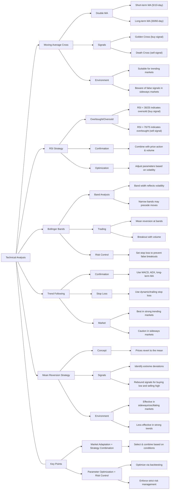

# InaVision-Markets
Quantitative analysis of the stock market, the impact of global economic conditions and major events on market performance, and the future development of the economy.

---
## Thinking
#### First, we screen and backtest stocks that perform well in bull and bear markets. Secondly, we test these strategies one by one.
#### The targets are divided into three categories: /A-shares/Hong Kong stocks/US stocks/stock types.
#### Then we target different fields: /traditional industries/commodities/technology stocks/
#### New fields: AI/robots/unmanned driving/hot sectors.
#### Backtest ETF C-shares.
#### Analyze the impact of major events on related stocks.
#### **Stock similarity analysis** with the same strategy can be used in key cities.
## Conclusion:
#### What kind of strategy is better for what kind of stocks?
#### How to better observe stock trends?
#### What is the impact of the current world economic situation on the stock market?
#### How to avoid risks as much as possible in the stock market and get relatively stable returns?
#### Outlook for the future economy.

## Abstract

**Summary of My Research Study Plan:**

1. **Segmentation by Market Conditions:**  
   I will classify stocks based on their performance in bull and bear markets. This approach will allow me to identify which stocks perform well under different market conditions, and I will backtest various technical analysis strategies separately for each scenario.

2. **Regional and Stock-Type Differentiation:**  
   I intend to focus on three main stock groups—A-shares (mainland Chinese stocks), Hong Kong stocks, and US stocks. By doing so, I aim to analyze the performance of different technical strategies across diverse market environments and regulatory settings.

3. **Sector-Based Analysis:**  
   I will categorize stocks by industry sectors. For example, I plan to conduct separate analyses for traditional industries, commodities, and technology stocks. Additionally, I will explore emerging fields such as AI, robotics, and autonomous driving to determine if these sectors respond differently to the strategies I employ.

4. **Backtesting with ETFs and Large-Cap Stocks:**  
   My study will include ETFs and large-cap (blue-chip) stocks to examine how these strategies perform in a broader market context. This inclusion will help me understand the impact of liquidity and volatility differences on strategy performance.

5. **Analysis of Major Events' Impact:**  
   I plan to investigate how significant global or economic events affect the performance of related stocks. This component of my research will provide insights into how external shocks influence the efficacy of technical analysis strategies.

6. **Stock Similarity Analysis:**  
   I will perform a similarity analysis among stocks that exhibit comparable reactions to the same strategies. This analysis will enable me to group stocks with similar behavior, facilitating the design of multi-strategy portfolios tailored to specific market conditions.

7. **Evaluation of Multiple Technical Strategies:**  
   I will rigorously backtest various technical analysis strategies, including Moving Average Cross, RSI, Bollinger Bands, and Trend Following. The objective is to determine which strategies yield the best results for different types of stocks and market conditions.

8. **Key Research Questions:**  
   - Which technical analysis strategies are most effective for specific types of stocks (e.g., technology versus traditional industries)?  
   - How can I enhance the observation and analysis of stock trends to generate more reliable trading signals?  
   - What impact do global economic conditions and major events have on stock market performance, and how can these factors be integrated into strategy development?  
   - How can risk be minimized to achieve relatively stable returns in volatile market environments?  
   - What future economic trends can be anticipated, and how might they affect the performance and selection of stock trading strategies?
