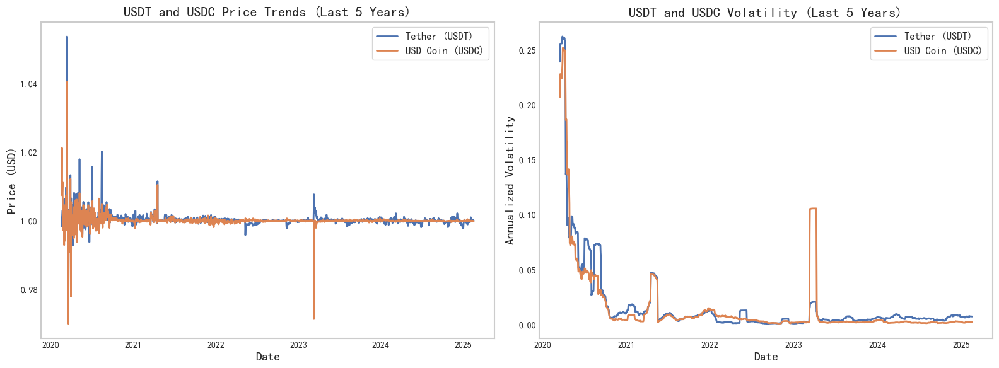
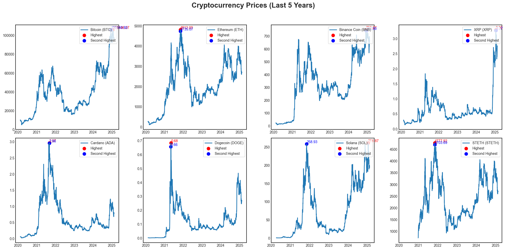

# InaVision-Markets
Quantitative analysis of the stock market, the impact of global economic conditions and major events on market performance, and the future development of the economy.

  

---
## Abstract

1. **Segmentation by Market Conditions:**  

2. **Regional and Stock-Type Differentiation:**  

3. **Sector-Based Analysis:**
4. **Backtesting with ETFs and Large-Cap Stocks:**
5. **Analysis of Major Events' Impact:**  

   

6. **Stock Similarity Analysis:**  

7. **Evaluation of Multiple Technical Strategies:**  

8. **Key Research Questions:**  
   - Which technical analysis strategies are most effective for specific types of stocks (e.g., technology versus traditional industries)?  
   - How can I enhance the observation and analysis of stock trends to generate more reliable trading signals?  
   - What impact do global economic conditions and major events have on stock market performance, and how can these factors be integrated into strategy development?  
   - How can risk be minimized to achieve relatively stable returns in volatile market environments?  
   - What future economic trends can be anticipated, and how might they affect the performance and selection of stock trading strategies?
## First Cryptocurrency Market
### Analyzing the Cryptocurrency Market with ccxt

  

### 1.Is the popular dual moving average strategy really useful for long-term cryptocurrency investment?
### 2.Stablecoin (USDT/USDC) volatility

  

### 3.Mainstream cryptocurrencies performance over 5 years

  

### 4.Results display

