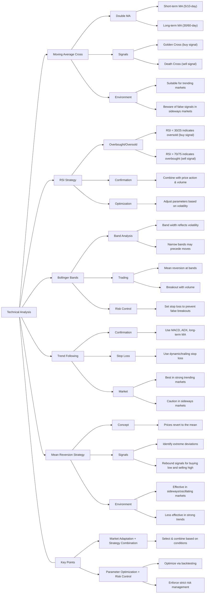

```mermaid
graph LR
  A["Technical Analysis"]

  %% Moving Average Cross Strategy
  A --> B["Moving Average Cross"]
  
  B --> B1["Double MA"]
  B1 --> B1a["Short-term MA (5/10-day)"]
  B1 --> B1b["Long-term MA (30/60-day)"]

  B --> B2["Signals"]
  B2 --> B2a["Golden Cross (buy signal)"]
  B2 --> B2b["Death Cross (sell signal)"]

  B --> B3["Environment"]
  B3 --> B3a["Suitable for trending markets"]
  B3 --> B3b["Beware of false signals in sideways markets"]

  %% RSI Strategy
  A --> C["RSI Strategy"]
  
  C --> C1["Overbought/Oversold"]
  C1 --> C1a["RSI < 30/25 indicates oversold (buy signal)"]
  C1 --> C1b["RSI > 70/75 indicates overbought (sell signal)"]

  C --> C2["Confirmation"]
  C2 --> C2a["Combine with price action & volume"]

  C --> C3["Optimization"]
  C3 --> C3a["Adjust parameters based on volatility"]

  %% Bollinger Bands Strategy
  A --> D["Bollinger Bands"]
  
  D --> D1["Band Analysis"]
  D1 --> D1a["Band width reflects volatility"]
  D1 --> D1b["Narrow bands may precede moves"]

  D --> D2["Trading"]
  D2 --> D2a["Mean reversion at bands"]
  D2 --> D2b["Breakout with volume"]

  D --> D3["Risk Control"]
  D3 --> D3a["Set stop loss to prevent false breakouts"]

  %% Trend Following Strategy
  A --> E["Trend Following"]
  
  E --> E1["Confirmation"]
  E1 --> E1a["Use MACD, ADX, long-term MA"]

  E --> E2["Stop Loss"]
  E2 --> E2a["Use dynamic/trailing stop loss"]

  E --> E3["Market"]
  E3 --> E3a["Best in strong trending markets"]
  E3 --> E3b["Caution in sideways markets"]

  %% Mean Reversion Strategy
  A --> G["Mean Reversion Strategy"]
  
  G --> G1["Concept"]
  G1 --> G1a["Prices revert to the mean"]

  G --> G2["Signals"]
  G2 --> G2a["Identify extreme deviations"]
  G2 --> G2b["Rebound signals for buying low and selling high"]

  G --> G3["Environment"]
  G3 --> G3a["Effective in sideways/oscillating markets"]
  G3 --> G3b["Less effective in strong trends"]

  %% Key Points
  A --- F["Key Points"]
  
  F --> F1["Market Adaptation + Strategy Combination"]
  F1 --> F1a["Select & combine based on conditions"]

  F --> F2["Parameter Optimization + Risk Control"]
  F2 --> F2a["Optimize via backtesting"]
  F2 --> F2b["Enforce strict risk management"]


```
